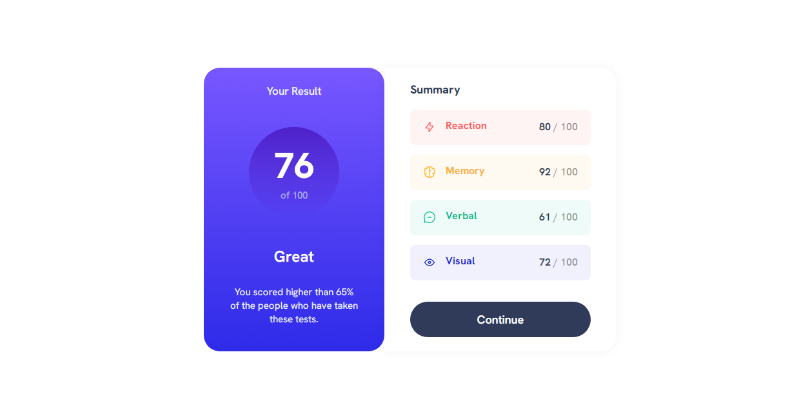

# Frontend Mentor - Results summary component

## Overview



This project is a dynamic result summary component built using HTML, CSS, and JavaScript. The component fetches data from a JSON file and displays the results in an aesthetically pleasing and user-friendly manner.

## Features
1. Dynamic Data Loading: Fetches and displays data from a JSON file using JavaScript's fetch method.
2. Responsive Design: Adapts to various screen sizes for optimal viewing on different devices.
3. Interactive UI: Provides a visually appealing summary of results with a clear and intuitive layout.

## Built with

- Semantic HTML5 markup
- CSS custom properties
- Flexbox

## Usage 

1. Clone the repository:
   
```bash
  git clone https://github.com/your-username/result-summary-component.git
  cd result-summary-component
```
2. Open the `index.html` file in your preferred web browser.

## License
This project is licensed under the MIT License. 

## Links

- Live Site URL: [Result summary Component](https://result-summary-component-100.netlify.app/)


## Author

Kingsley Kamkwamba
- Frontend Mentor - [@Kingsley](https://www.frontendmentor.io/profile/kingsley2o18)
- Twitter - [@Kingsley](https://www.x.com/_kingsl3y)

## Acknowledgments

Frontend Mentor (Challenge and Design)
